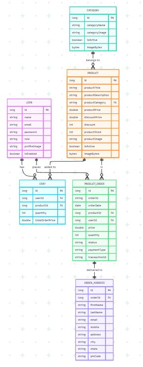
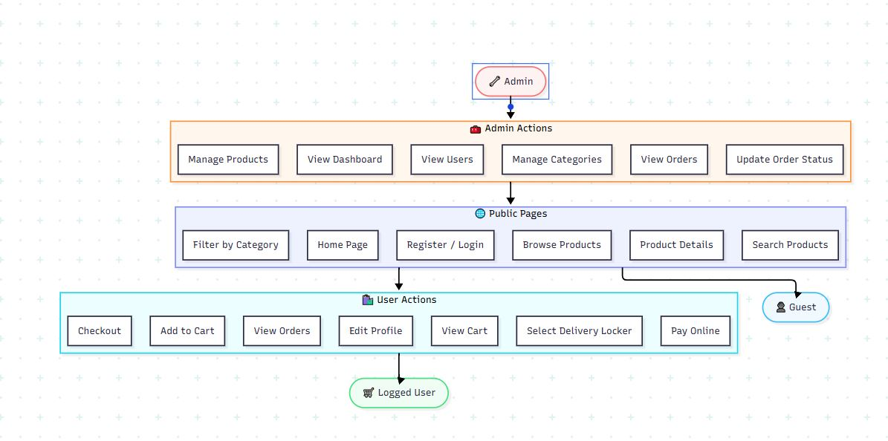

# SPSHOP — Sports Nutrition E-commerce Platform

SPSHOP is a modern e-commerce application built with Spring Boot, MySQL, and Stripe. It features a premium dark UI with glassmorphism effects and secure payment processing.

## Features
- **Modern UI**: Dark theme with gold accents, smooth animations, and responsive design.
- **Secure Payments**: Integrated with Stripe (Test Mode enabled).
- **Payment Security**: Encrypted transaction IDs for enhanced privacy.
- **Shopping Cart**: Real-time cart management with AJAX updates.
- **Admin Panel**: Full control over categories, products, and users.
- **Delivery**: Integration with local locker systems (Omniva/SmartPost style selection).

## Technologies
- **Backend**: Spring Boot 3.x, Spring Data JPA, Spring Security.
- **Frontend**: Thymeleaf, Bootstrap 5, SweetAlert2, jQuery.
- **Database**: MySQL.
- **Payments**: Stripe Java SDK.

## Prerequisites
- Java 17 or higher.
- MySQL Server.
- Maven.

## Setup Instructions

1. **Database Setup**:
   - Create a database named `ecommerce_store` in MySQL.
   - Update `src/main/resources/application.properties` with your database credentials.

2. **Stripe Configuration**:
   - The project is pre-configured with test keys.

## Running the Application

1. **Navigate to the application directory**:
   ```powershell
   cd Ecommerce_Store
   ```

2. **Start the local server**:
   Set `JAVA_HOME` pointing to JDK 17+ and run the Spring Boot application:
   ```powershell
   $env:JAVA_HOME="C:\Program Files\Weka-3-8-6\jre\zulu17.32.13-ca-fx-jre17.0.2-win_x64"
   .\mvnw.cmd spring-boot:run
   ```

3. **Accessing the Site**:
   - 🛒 **Storefront**: [http://localhost:8080/](http://localhost:8080/)
   - 👤 **User Profile / Dashboard**: [http://localhost:8080/user/](http://localhost:8080/user/)
   - ⚙️ **Admin Panel Dashboard**: [http://localhost:8080/admin/](http://localhost:8080/admin/)

---

## Architecture & Design

### Entity Relationship Diagram (ERD)


### UML Class Diagram


---

### CRUD — Role Permissions

| Action | Guest | User | Admin |
|---|:---:|:---:|:---:|
| **BROWSING** | | | |
| View Home Page | ✅ | ✅ | ✅ |
| Browse Product Catalog | ✅ | ✅ | ✅ |
| Filter by Category | ✅ | ✅ | ✅ |
| View Product Details | ✅ | ✅ | ✅ |
| Search Products | ✅ | ✅ | ✅ |
| **ACCOUNT** | | | |
| Register | ✅ | ❌ | ❌ |
| Sign In | ✅ | ❌ | ❌ |
| View Profile | ❌ | ✅ | ✅ |
| Edit Profile | ❌ | ✅ | ✅ |
| Change Password | ❌ | ✅ | ✅ |
| Sign Out | ❌ | ✅ | ✅ |
| **CART & ORDERS** | | | |
| Add Product to Cart | ❌ | ✅ | ❌ |
| View Cart | ❌ | ✅ | ❌ |
| Proceed to Checkout | ❌ | ✅ | ❌ |
| Select Delivery Locker | ❌ | ✅ | ❌ |
| Pay via Stripe | ❌ | ✅ | ❌ |
| View Own Order History | ❌ | ✅ | ❌ |
| **ADMIN — CATEGORIES** | | | |
| Add Category | ❌ | ❌ | ✅ |
| Edit Category | ❌ | ❌ | ✅ |
| Delete Category | ❌ | ❌ | ✅ |
| Toggle Active/Inactive | ❌ | ❌ | ✅ |
| **ADMIN — PRODUCTS** | | | |
| Add Product | ❌ | ❌ | ✅ |
| Edit Product | ❌ | ❌ | ✅ |
| Delete Product | ❌ | ❌ | ✅ |
| Toggle Active/Inactive | ❌ | ❌ | ✅ |
| **ADMIN — ORDERS & USERS** | | | |
| View All Orders | ❌ | ❌ | ✅ |
| View Order Details | ❌ | ❌ | ✅ |
| Update Order Status | ❌ | ❌ | ✅ |
| View All Users | ❌ | ❌ | ✅ |

---

## Testing Suite

SPSHOP is backed by a fully robust testing architecture containing **77 comprehensive tests** spanning unit, integration, and modern End-to-End (E2E) testing.

### Test Architecture

- **E2E Playwright Tests** (`com.mdtalalwasim.ecommerce.e2e.EcommerceE2eTest`):
  Runs a headless browser using Microsoft Playwright to test full-page user behaviors:
  1. *Purchase Lifecycle*: Adding products to cart, locker selection, checkout, and dashboard order status check.
  2. *Authentication & Profiling*: Registering, logging in, updating profile details, and checking the orders timeline.
  3. *Dynamic Catalog*: Live catalog searches and real-time category filtering.
  4. *Admin Operations*: Dynamically creating categories and products with custom file uploads, verifying they are propagated immediately to the customer storefront.
  
  🎥 **Watch Recorded Test Videos**: You can watch the recorded Playwright E2E browser execution videos directly in your browser here: [http://localhost:8080/test-videos](http://localhost:8080/test-videos)

- **Service Layer Tests** (`com.mdtalalwasim.ecommerce.service.*`):
  Unit tests covering business rules for Carts, Products, Orders, Users, and Category management using Mockito.
- **Controller/REST API Integration Tests** (`com.mdtalalwasim.ecommerce.controller.*`):
  Ensures routing, standard security configurations, and JSON endpoints perform as expected.

### Test Execution Commands

1. **Navigate to the application directory**:
   ```powershell
   cd Ecommerce_Store
   ```

2. **Run tests** (always prepend the `JAVA_HOME` environment variable targeting your Zulu 17 JRE):

#### 1. Run ALL Tests (77/77 tests)
Runs every unit, integration, and E2E browser test:
```powershell
$env:JAVA_HOME="C:\Program Files\Weka-3-8-6\jre\zulu17.32.13-ca-fx-jre17.0.2-win_x64"; .\mvnw.cmd test
```

#### 2. Run ONLY End-to-End (E2E) Tests
Runs the Microsoft Playwright headless E2E browser test suite:
```powershell
$env:JAVA_HOME="C:\Program Files\Weka-3-8-6\jre\zulu17.32.13-ca-fx-jre17.0.2-win_x64"; .\mvnw.cmd test -Dtest=EcommerceE2eTest
```

#### 3. Run ONLY Service Layer Unit Tests
Runs Mockito service mocks:
```powershell
$env:JAVA_HOME="C:\Program Files\Weka-3-8-6\jre\zulu17.32.13-ca-fx-jre17.0.2-win_x64"; .\mvnw.cmd test -Dtest=*ServiceImplTest
```

#### 4. Run ONLY Controller Integration Tests
Runs security and web MVC integration tests:
```powershell
$env:JAVA_HOME="C:\Program Files\Weka-3-8-6\jre\zulu17.32.13-ca-fx-jre17.0.2-win_x64"; .\mvnw.cmd test -Dtest=*ControllerIntegrationTest
```

---

## Testing Payments
While in Test Mode, use the following card details:
- **Card Number**: `4242 4242 4242 4242`
- **Expiry**: Any future date (e.g., `12/27`)
- **CVC**: `123`
- **ZIP**: `12345`

## Project Structure
- `src/main/java`: Backend logic and services.
- `src/main/resources/templates`: Thymeleaf HTML templates.
- `src/main/resources/static`: CSS, JS, and image assets.
- `src/main/java/.../utils/SecurityUtils.java`: Secure ID encoding logic.
